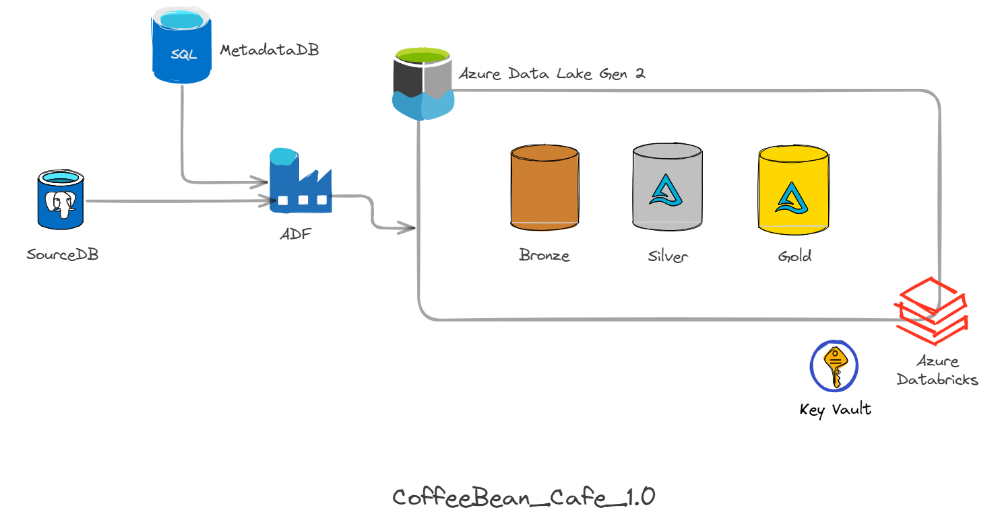

# ☕ Coffee Bean Analytics – Metadata-Driven Azure Data Engineering Pipeline

<p align="center">


</p>

---

## Overview

Coffee Bean Analytics is an **end-to-end Azure Data Engineering project** that demonstrates how to build a **metadata-driven, production-oriented data platform** using the Medallion Architecture.

Transactional data is ingested from **NeonDB (PostgreSQL)** through **Azure Data Factory**, stored in **Azure Data Lake Storage Gen2**, transformed using **Azure Databricks**, and published as a **Star Schema** for analytical reporting.

The project focuses on building a reusable engineering framework rather than table-specific pipelines by implementing:

- Metadata-driven pipeline orchestration
- Full & Incremental data ingestion
- Watermark-based incremental processing
- Late-arriving data handling
- Data Quality Validation
- Schema Drift Detection
- Controlled Schema Evolution
- Slowly Changing Dimension (Type 2)
- Delta Lake MERGE (Idempotent Processing)
- Unity Catalog Governance
- Azure Key Vault Integration
- Dimensional Modeling (Star Schema)

---

# Table of Contents

- [Overview](#overview)
- [Data Flow](#data-flow)
- [Architecture Diagram](#architecture-diagram)
- [Technology Stack](#technology-stack)
- [Project Statistics](#-project-statistics)
- [Repository Tour](#repository-tour)
- [Source ER Diagram](#source-er-diagram)
- [Gold Star Schema](#gold-star-schema)
- [Medallion Architecture](#medallion-architecture)
- [Key Architectural Decisions](#key-architectural-decisions)
- [Repository Structure](#repository-structure)
- [Future Improvements](#future-improvements)
- [Lessons Learned](#lessons-learned)
- [License](#license)

---

# Data Flow

```text
                    NeonDB (PostgreSQL)
                            │
                            ▼
                Azure Data Factory (ADF)
                            │
                            ▼
              Bronze Layer (Parquet - ADLS Gen2)
                            │
                            ▼
              Azure Databricks (Bronze → Silver)
        • Data Quality Validation
        • Duplicate Removal
        • Schema Drift Detection
        • Schema Evolution
        • SCD Type 2
        • Delta MERGE
                            │
                            ▼
              Silver Layer (Delta Lake)
                            │
                            ▼
              Azure Databricks (Silver → Gold)
        • Star Schema Modeling
        • Dimension Building
        • Fact Table Generation
                            │
                            ▼
               Gold Layer (Delta Lake)
                            │
                            ▼
          Power BI / Reporting / Analytics
```

---

# Architecture Diagram

The following diagram illustrates the overall system architecture, showing the flow of data from the operational source system to the analytical layer.

> **Architecture Diagram Placeholder**

```text
docs/
└── architecture/
    └── architecture-diagram.png
```

Once the diagram is added, it will appear below.



---
