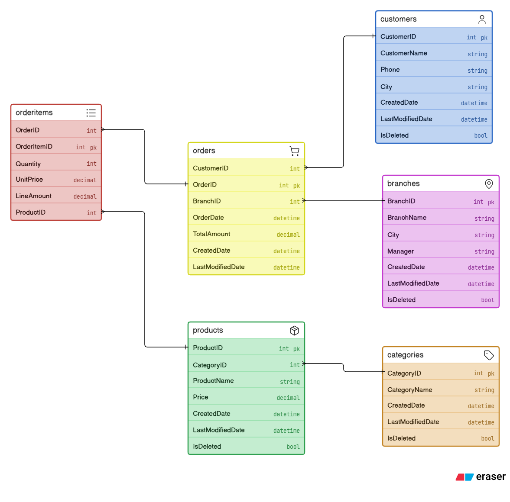
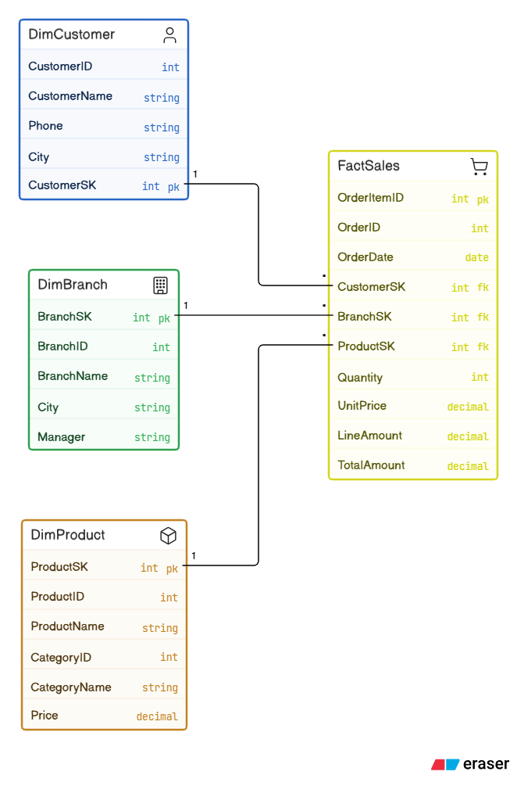

# ☕ Coffee Bean Analytics – Metadata-Driven Azure Data Engineering Pipeline


---

## Overview

Coffee Bean Analytics demonstrates an **end-to-end metadata-driven Azure Data Engineering solution** built using the Medallion Architecture.

The pipeline ingests transactional data from **NeonDB (PostgreSQL)**, orchestrates ingestion through **Azure Data Factory**, performs scalable transformations in **Azure Databricks**, and publishes analytics-ready dimensional models into the Gold layer.

The solution emphasizes **reusability**, **maintainability**, and **production-ready engineering practices**, including:

- Metadata-driven processing
- Full & Incremental Loading
- Watermarking
- Late-arriving Data Handling
- Data Quality Validation
- Schema Drift Detection
- Explicit Schema Evolution
- Slowly Changing Dimension (Type 2)
- Delta Lake MERGE
- Unity Catalog Governance
- Azure Key Vault Integration
- Star Schema Modeling

---

## Repository Tour

| Folder | Description |
|---------|-------------|
| `/adf` | Azure Data Factory pipelines, datasets, linked services, and triggers |
| `/databricks` | PySpark notebooks implementing Bronze→Silver and Silver→Gold transformations |
| `/sql` | Source schema, metadata tables, stored procedures, and initialization scripts |
| `/docs/architecture` | Architecture diagrams, ER model, Star Schema, and pipeline screenshots |

---

# Table of Contents

- Overview
- Technology Stack
- Project Statistics
- Architecture Diagram
- Source ER Diagram
- Gold Star Schema
- Medallion Architecture
- Key Architectural Decisions
- Repository Structure
- Future Improvements
- Lessons Learned

---

# Technology Stack

| Layer | Technology |
|---------|------------|
| Source Database | NeonDB (PostgreSQL) |
| Metadata Repository | Azure SQL Database |
| Orchestration | Azure Data Factory |
| Processing | Azure Databricks |
| Storage | Azure Data Lake Storage Gen2 |
| Bronze Format | Parquet |
| Silver & Gold Format | Delta Lake |
| Governance | Unity Catalog |
| Secrets | Azure Key Vault |
| Language | Python, PySpark, SQL |

---


# 📊 Project Statistics

| Metric | Value |
|--------|-------|
| Source Tables | 6 |
| Silver Tables | 6 |
| Gold Tables | 4 |
| Azure Services | 6 |
| Databricks Notebooks | 2 |
| Metadata-Driven | Yes |
| SCD Type 2 Tables | Customers, Products, Branches |
| Incremental Load | Customers, Orders, OrderItems |
| Full Load | Categories, Products, Branches |

---

## Architecture Diagram


---

# Source ER Diagram



---

# Gold Star Schema



---

# Medallion Architecture

## Bronze Layer

Responsibilities

- Store raw source data
- Preserve source fidelity
- Support replay
- Immutable storage
- Parquet format
- Loaded using Azure Data Factory

---

## Silver Layer

Responsibilities

- Data Quality Validation
- Remove Duplicate Records
- Schema Drift Detection
- Explicit Schema Evolution
- SCD Type 2
- Delta MERGE
- Metadata-Driven Transformations

---

## Gold Layer

Responsibilities

- Star Schema
- Analytical Reporting
- Business-ready datasets
- Optimized for Power BI

---

# Key Architectural Decisions

## 1. Metadata-Driven Pipeline

### Problem

Hardcoding ingestion and transformation logic for every source table creates duplicated code, increases maintenance effort, and makes onboarding new tables difficult.

### Design Decision

Implemented a metadata-driven framework where Azure SQL stores table-specific configuration in **TransformationConfig**, including:

- BusinessKey
- CompareColumns
- RequiredColumns
- MergeStrategy
- SCDType
- WatermarkColumn

Azure Data Factory dynamically orchestrates ingestion while a single reusable Databricks notebook processes all tables using this metadata.

### Benefits

- Eliminates duplicated pipeline logic
- Simplifies onboarding new tables
- Centralizes transformation rules
- Improves maintainability and scalability

---

## 2. Incremental Loading & Late-arriving Data

### Problem

Strict watermark-based loading can miss records arriving after the previous execution.

### Design Decision

Implemented watermark-based extraction using the **LastModifiedDate** column together with an Azure SQL **Watermark** table.

A configurable lookback window reprocesses recent data during every execution.

### Trade-off

Reprocessing historical data intentionally introduces duplicate candidate records.

These are safely eliminated downstream through Delta MERGE and business-key comparison, ensuring idempotent processing while significantly improving data completeness.

### Alternatives Considered

Source-side CDC was considered but requires database configuration and operational complexity.

---

## 3. Reusable SCD Type 2 Framework

### Problem

Master data changes must preserve historical versions while avoiding separate implementations for every dimension.

### Design Decision

Built a reusable metadata-driven SCD Type 2 framework using configurable Business Keys and Compare Columns.

Historical tracking is maintained through:

- EffectiveStartDate
- EffectiveEndDate
- IsCurrent

Incoming records are staged before executing a single Delta MERGE.

### Benefits

- Reusable across multiple dimensions
- Historical accuracy
- Centralized business logic

---

## 4. Controlled Schema Evolution

### Problem

Unexpected schema changes can silently corrupt downstream datasets.

### Design Decision

Schema drift is detected during Bronze → Silver transformation.

New columns are validated and explicitly applied using **ALTER TABLE** before Delta MERGE execution.

### Trade-off

Adds validation overhead but provides stronger governance than automatic schema evolution.

### Alternatives Considered

Automatic `mergeSchema` was evaluated but rejected to maintain explicit control over structural changes.

---

## 5. Idempotent Processing

### Problem

Pipeline retries should never create duplicate or inconsistent data.

### Design Decision

Combined duplicate removal, business-key comparison, and Delta MERGE to ensure repeated executions always converge to the same final dataset.

### Benefits

- Safe reruns
- Atomic writes
- Reliable recovery

---

## 6. Governance & Security

### Problem

Enterprise data platforms require centralized governance and secure credential management.

### Design Decision

Unity Catalog governs catalogs, schemas, external locations, and Delta tables.

Azure Key Vault securely stores secrets consumed by Azure Data Factory and Databricks.

### Benefits

- Centralized governance
- Secure credential management
- Reduced operational risk

---

## 7. Star Schema Modeling

### Problem

Highly normalized OLTP schemas are inefficient for analytical workloads.

### Design Decision

Transformed curated Silver Delta tables into:

- DimCustomer
- DimBranch
- DimProduct
- FactSales

### Benefits

- Faster analytical queries
- Simplified reporting
- BI-friendly semantic model

---

## 8. Layered Medallion Architecture

### Problem

Mixing raw, validated, and business-ready data tightly couples ingestion with reporting.

### Design Decision

Separated responsibilities into:

Bronze

- Raw immutable data

Silver

- Cleansed
- Validated
- Historized

Gold

- Business-ready dimensional models

### Benefits

- Clear separation of concerns
- Easier replay
- Independent evolution
- Better maintainability

---

# Repository Structure

```text
.
├── adf/
├── databricks/
│   ├── bronze_to_silver
│   └── silver_to_gold
├── sql/
├── docs/
├── images/
└── README.md
```

---

# Future Improvements

- Change Data Capture (CDC)
- CI/CD using Azure DevOps
- Pipeline Audit Framework
- Delta OPTIMIZE & ZORDER
- Data Quality Dashboard
- Automated Unit Testing

---

# Lessons Learned

- Metadata-driven frameworks significantly reduce duplicated ETL logic.
- Explicit schema evolution provides stronger governance than automatic schema merging.
- Separating change detection from persistence simplifies reusable SCD Type 2 implementations.
- Idempotent processing greatly simplifies operational recovery.
- Late-arriving data handling is essential for production-grade incremental pipelines.

---

# License

This project is intended for learning and portfolio purposes.
